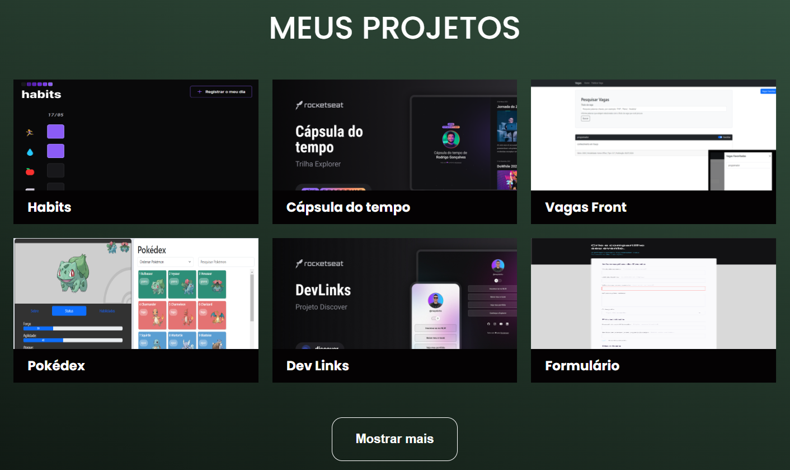

<h1 align="center"> Portifólio simples </h1>

Projeto promovido por Dev em Dobro na Semana do Zero ao Programador. A aplicação foi adaptada e continuada senguindo à necessidade de montar o meu portifólio de maneira mais simplificada.

  <a href="#-tecnologias">Tecnologias</a>&nbsp;&nbsp;&nbsp;|&nbsp;&nbsp;&nbsp;
  <a href="#-layout">Layout</a>

  

  

 

## 🚀 Tecnologias

Esse projeto foi desenvolvido com as seguintes tecnologias:

- HTML e CSS
- JavaScript
- Git e Github

## 💻 Projeto

Portifólio simples é uma aplicação WEB em que me apresento de maneira profissional, contendo meus contatos e aos meus projetos já desenvolvidos com as tecnologias utilizadas, sendo encaminhado para minha página no GitHub.

 Feito com ♥

